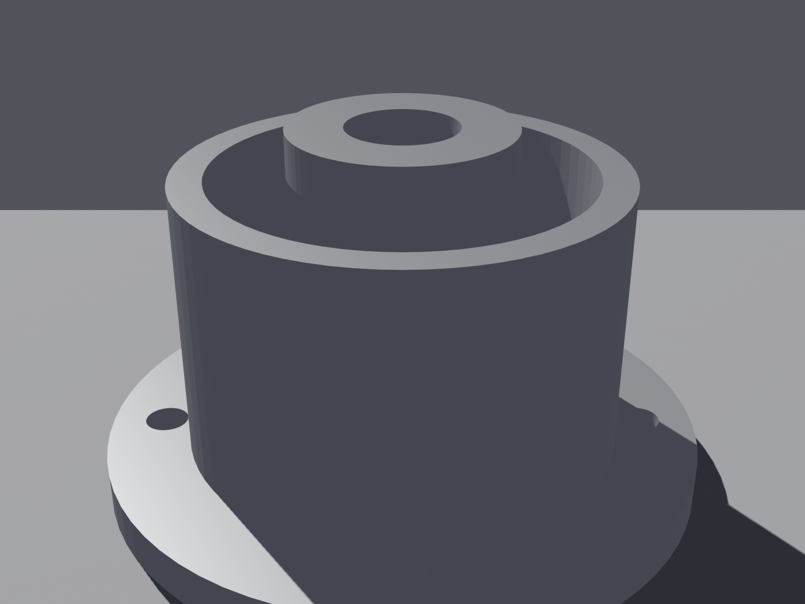
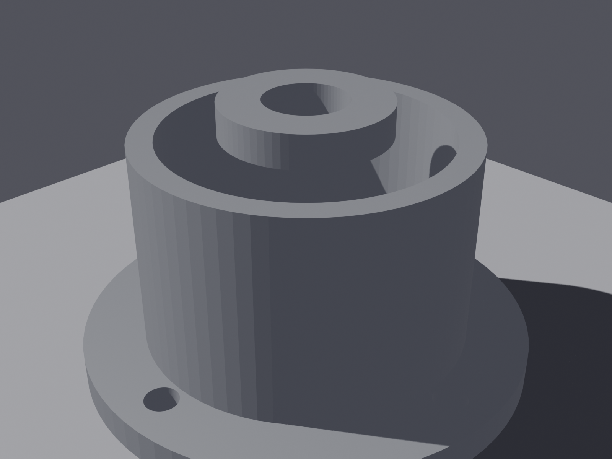
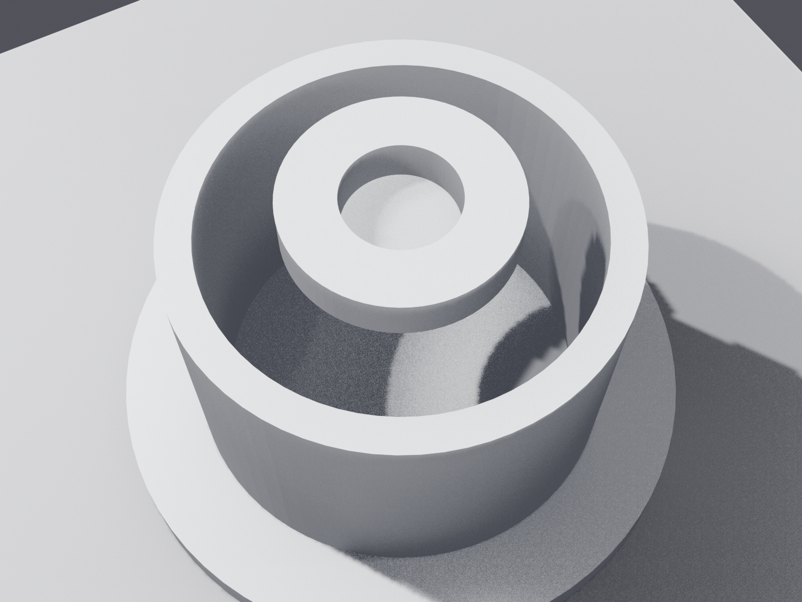
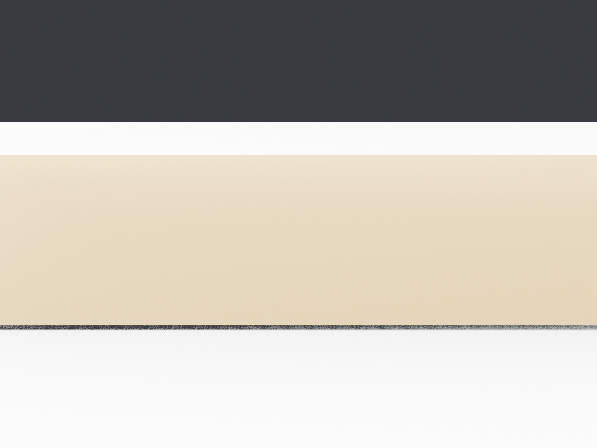
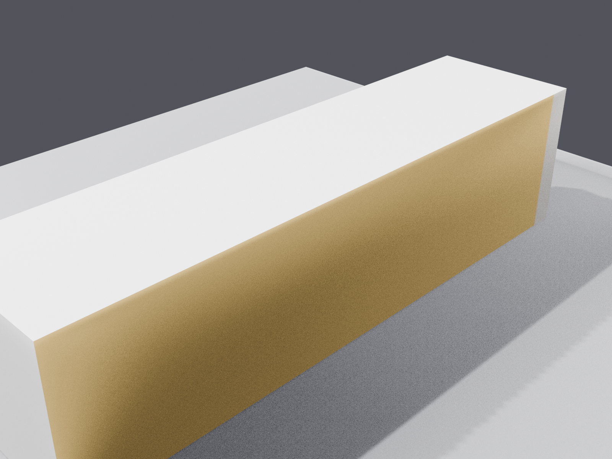
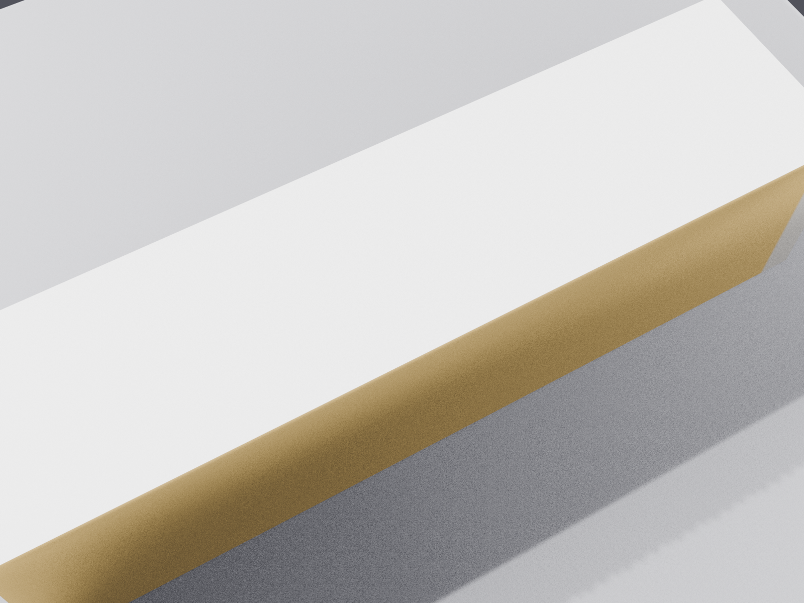
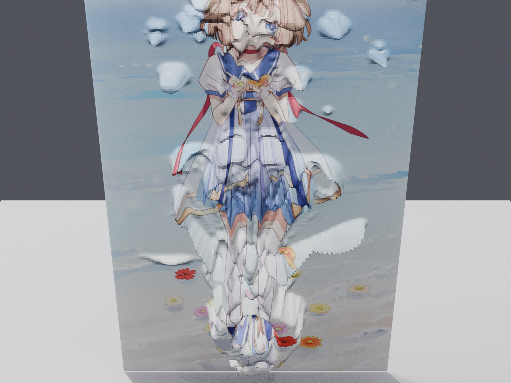
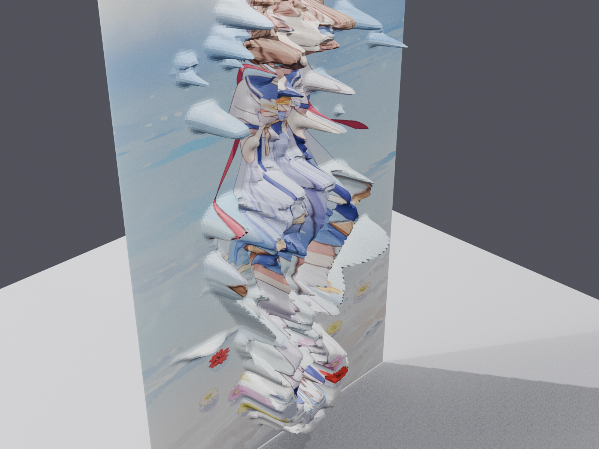
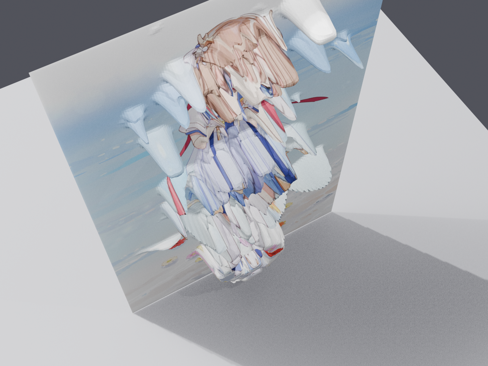

# 一句话生成三维模型 · 二维设计稿/图纸 → 3D（考题四技术向）

> 目标：用「自然语言/参数 + Blender Python 脚本」自动化完成
> **建模 → 贴图 → 材质 → 渲染 → 导出**，把二维素材变成可查看、可旋转的三维结果。

## 核心成果（三个原型）

| 原型 | 二维输入 | 三维结果 | 说明 |
|---|---|---|---|
| **P3 CAD 机械壳体（主案例）** | `assets/cad_8191871.jpg` 机械零件工程图 | `output/housing_view.blend` / `housing.glb` / 三视角 PNG | 按"阶梯回转壳体"参数化建模（法兰+主体+凸台+内腔+安装孔），**用 Blender 直接打开查看** |
| P1 包装盒 | `assets/front.png` 正面设计图 | `output/preview_front.png` / `preview.glb` | 六面贴图长方体包装盒 |
| P2 人物浮雕 | `assets/鹿乃2.jpg` | `output/person_front.png` / `person.glb` | 最近背景样本抠图 + 高度图浮雕（2.5D） |
| **P4 液压缸** | `assets/cad2_kAmpQGMUEd7t9Zok.jpg` 机械零件图纸 | `output/hydraulic_view.blend` / `hydraulic.glb` / 多视角 PNG | 缸筒+两端法兰+活塞杆+油口，参数化建模，Blender 打开查看 |
| 工业刀版图 | — | `assets/industrial/fefco0201_dieline.svg/png` | 按 FEFCO 0201 标准生成的展开刀版图（v2 折叠素材） |

## 成果展示（渲染成果图）

> 图片位于仓库 `output/`，GitHub 可直接渲染；也可用 Blender 打开 `output/*_view.blend` 交互查看。

### P3 阶梯回转壳体（CAD 机械零件）




### P4 液压缸（CAD 机械零件）


### P1 包装盒




### P2 人物浮雕



## 最快查看 3D 结果（推荐）

**用 Blender 打开**（不依赖浏览器 WebGL）：

```
blender output/housing_view.blend
```

操作：中键旋转、滚轮缩放、Shift+中键平移；小键盘 1/3/7 切换前/右/顶视图。

## 自然语言驱动（一句话 → 3D）

用户输入一句自然语言，AI 将其转成结构化参数并自动调用 Blender 得到结果：

```powershell
python scripts/nl_to_3d.py --text "做一个包装盒 200x120x80 mm" --blender "<blender路径>"
python scripts/nl_to_3d.py --text "生成液压缸 缸筒外径80 长260" --blender "<blender路径>"
python scripts/nl_to_3d.py --text "做一个阶梯回转壳体"          --blender "<blender路径>"
python scripts/nl_to_3d.py --text "壳体" --demo-only   # 只看 NL→JSON 解析
```

- **AI 参与全流程实录**（真实对话决策 + CAD 尺寸来源标注：哪些来自图纸 / 一句话 / AI 默认）见 [docs/nl_driven_workflow.md](docs/nl_driven_workflow.md)；
- 演示产物：`output/nl_*.json`、`output/nl_*.glb`、`output/nl_*_*.png`。
## 一键复现（推荐）

```powershell
python scripts/run_all.py                     # 自动探测 Blender/Python
python scripts/run_all.py --blender "C:\Program Files\Blender Foundation\Blender 5.0\blender.exe" --python <你的python>
python scripts/run_all.py --keep-going        # 某步失败仍继续
```

自动按依赖顺序运行：冒烟 → 素材生成 → 4 个案例建模 → 生成 4 个 `.blend` → 统一渲染 12 张展示图；每步日志在 `logs/run_all_*.log`。
## 命令行复现

```powershell
# 1) 冒烟测试
blender --background --python tests/smoke_test.py --python-exit-code 1

# 2) CAD 机械壳体建模（阶梯回转壳体，参数见脚本头部）
blender --background --python scripts/build_housing.py -- --out output/housing

# 3) 包装盒（单张正面图 -> 盒）
blender --background --python scripts/build_pack.py -- --front assets/front.png --out output/preview

# 4) 人物浮雕
python scripts/make_relief_maps.py --input assets/鹿乃2.jpg
blender --background --python scripts/person_relief.py -- --albedo assets/relief_albedo.png --height assets/relief_height.png --out output/person

# 5) FEFCO 0201 工业刀版图
python scripts/make_fefco_dieline.py
```

## 提交内容对照（考题要求）

| 考题要求 | 位置 |
|---|---|
| 二维输入素材 | `assets/`（CAD 图纸、包装正面图、人物图、工业刀版图） |
| Blender 脚本 | `scripts/`（build_housing / build_pack / person_relief 等） |
| 模型或渲染成果 | `output/`（.blend / .glb / 多视角 PNG） |
| 实验截图 | `output/*.png`（渲染即实验截图） |
| 简单分析报告 | `docs/analysis.md` |
| 使用说明 | `docs/usage.md` |
| 开发日志与日程记录 | `logs/dev_log.md`、`logs/schedule.md` |

## 工具脚本一览

| 脚本 | 职责 |
|---|---|
| `scripts/run_all.py` | 一键复现全部（19 步：冒烟→素材→4 建模→4 blend→4 渲染→2 尺寸审计→修改引擎自检） |
| `scripts/nl_to_3d.py` | 自然语言 → 结构化 JSON → 调 Blender（演示管线） |
| `scripts/nl_modify_script.py` | 一句话 → **修改建模脚本**（生成修改版副本 + diff）→ 运行 |
| `scripts/audit_dimensions.py` | **尺寸来源审计**：逐条标注 图纸/一句话/AI默认 |
| `scripts/blender_utils.py` | 公共工具（find_blender 等，避免重复代码） |
| `scripts/build_*.py` | 参数化建模（壳体/液压缸/包装盒/浮雕），单位 mm |
| `scripts/render_glb.py` | 从 GLB 自动取景渲染多视角图 |
| `scripts/make_blend_view.py` | GLB → 可 Blender 打开的 .blend |
| `scripts/make_fefco_dieline.py` / `make_relief_maps.py` | 素材预处理 |
## 技术路线要点

- 几何走**参数化模板/脚本**（回转体、盒体），LLM 一句话 + 迭代修改即可重建；
- 贴图用**分面映射**（包装盒）或**最近背景样本抠图 + 高度图**（人物浮雕）；
- 全部**无头(headless)可复现**，脚本化、Git 可追溯；
- 3D 查看：**用 Blender 直接打开 `output/*_view.blend`**（最可靠）。浏览器 three.js 预览需 WebGL，在受限浏览器中不可用，故仓库不附带预览页。
